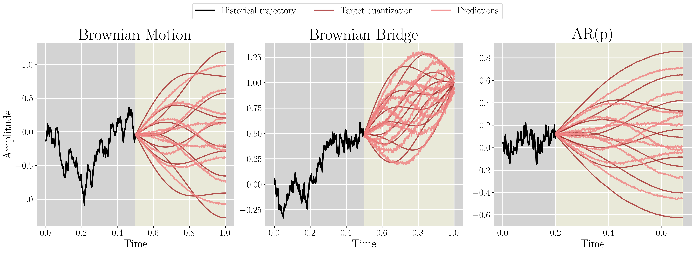

# Code for *Winner-Takes-All for Multivariate Probabilistic Time Series Forecasting* (ICML 2025)

This repository contains the source code associated with the publication *Winner-Takes-All for Multivariate Probabilistic Time Series Forecasting* (ICML 2025). 

<div align="center"> <h3> Abstract </h3>  </div>
<div align="justify">

We introduce **TimeMCL**, a method leveraging the Multiple Choice Learning (MCL) paradigm to forecast multiple plausible time series futures. Our approach employs a neural network with multiple heads and utilizes the Winner-Takes-All (WTA) loss to promote diversity among predictions. MCL has recently gained attention due to its simplicity and ability to address ill-posed and ambiguous tasks. We propose an adaptation of this framework for time-series forecasting, presenting it as an efficient method to predict diverse futures, which we relate to its implicit \textit{quantization} objective. We provide insights into our approach using synthetic data and evaluate it on real-world time series, demonstrating its promising performance at a light computational cost.

</br>

## Repository Structure

```shell
└── toy # Code for reproducing the experiments with synthetic data
└── tsExperiments # Code for reproducing the experiments with real world datasets
```

## Fast demo

For fast prototyping, we provide a notebook in `demo/TimeMCL-Solar.ipynb` for training, inference, evaluation and plotting.

## Synthetic data experiments

This part of the code focuses on **toy experiments** with synthetic data. These toy experiments help illustrate the *TimeMCL* model's underlying theory and demonstrate, on controlled examples, how *TimeMCL* acts as a functional quantizer of stochastic processes.

### Datasets

The synthetic experiments use three types of datasets:
- **ARp**: Autoregressive process of order p
- **Brownian Motion**: Standard Brownian motion process
- **Brownian Bridge**: Brownian bridge process

### Setup

If you have conda, you can create an environment with:

```shell
conda create -n synth_env -y python=3.10.15
```

Then, close and re-open your shell, and activate your environment:

```shell
conda activate synth_env
```

Install the required dependencies:

```shell
cd toy
pip install -r requirements.txt
```

### Training and inference

For training TimeMCL on the synthetic datasets, run:

```shell
python train.py --config=config/ARp.yaml
python train.py --config=config/brownian_motion.yaml
python train.py --config=config/brownian_bridge.yaml
```

Checkpoints will be stored in `toy/logs/trained_timeMCL_{dataset_name}.pth`.

For inference and visualization, please run:

```shell
python plot.py
```

The figure will be stored in `toy/figures/toy_figure.png`.



## Real datasets experiments

### Setup

To reproduce the experiments on real-world dataset, you can setup an environment as follows. This setup assumes you have Python3 installed (we used Python 3.10.15).

```shell
cd tsExperiments
bash setup-env.sh
```

The environment variable ENV_DIR should then be set. You can activate the environment with 

```shell
source $ENV_DIR/bin/activate
```

### Training

To train timeMCL with 16 hypotheses on all the datasets `('electricity' 'exchange' 'solar' 'taxi' 'traffic' 'wiki')` with seed 3141, with annealed and relaxed variants (with default parameters), use the following commands:

```shell
bash train.sh 3141 all 16 timeMCL awta # For the annealed variant
bash train.sh 3141 all 16 timeMCL relaxed-wta # For the relaxed variant
```

To train the different baselines, on all the datasets with seed 3141 use the following commands:

```shell
bash train.sh 3141 all tempflow
bash train.sh 3141 all tactis2
bash train.sh 3141 all timeGrad
bash train.sh 3141 all ETS
bash train.sh 3141 all deepAR
bash train.sh 3141 all transformer_tempflow
```

When launching the above trainings, the logs will be saved in `tsExperiments/logs` following the [Hydra](https://github.com/facebookresearch/hydra) template, that is organized as follows:

```shell
└── tsExperiments 
  └── logs
    └── <experiment_name> # By default: <dataset_name>_<num_epochs>
      └── runs
        └── <run_folder_name> # By Default: <start_run_time>_<dataset_name>_<model>_<num_hypotheses>_<model_specificities>, where start_run_time is in the form %Y-%m-%d_%H-%M-%S and <model_specificities> applicable only for the timeMCL runs. 
          ├── Prediction_plot.png # Visualisations of the predictions on the test set (if enabled).
          ├── {context_points,forecast_length,freq_type,hypothesis_forecasts,is_mcl,target_df}.pkl # Raw data to reproduce the plot if needed.
          └── .hydra # Folder to save the config yaml files associated with the run
          └── checkpoints # Folder where the checkpoints are saved. By default, it contains epoch_{best_epoch_number}.ckpt and last.ckpt, where the best epoch number is based on the validation loss. 
          └── tensorboard # Folder that contains tensorboard event files. 
```

### Inference and evaluation

To evaluate a model with a given checkpoint path, please write a command in this form (except for tactis2):

```shell
python train.py ckpt_path=${ckpt_path} experiment=${dataset}.yaml model=${model}.yaml run_name=seed_${training_seed}_${dataset}_${model}_${num_hyp} model.params.num_hypotheses=${num_hyp} logger.mlflow.experiment_name=eval_${dataset} task_name=eval_${dataset} seed=${inference_seed} train=False test=True model.compute_flops=False
```
where 
* `model` is the model to be evaluated, following the file names in `configs/model`.
* `training_seed` and `inference_seed` refer respectively to the seed that was used to train the model, and the seed that is used for evaluation.
* `dataset` is the dataset used for evaluation.
* `num_hyp` is the number of hypotheses (or samples) used for inference.

For Tactis2, please set instead of `ckpt_path`, `ckpt_path_phase1` and `ckpt_path_phase2`, for the path of the models of phase 1 and 2. 

If necessary, we provide `extract_ckpts.py`, a python script to automatize checkpoint path extraction. It can be executed by running:

```shell
python extract_ckpts.py 
```

And a json file named `ckpts.json` and containing the checkpoint paths will be created in the folder `tsExperiments/`.
In this case, the full evaluation can be performed by first installing `jq`, e.g., with `sudo apt-get update ; sudo apt-get install jq -y --fix-missing`.Then, the evaluation scripts for checkpoints trained with 16 hypotheses and seed 3141 can be launched:
```shell
bash eval.sh 3141 all timeMCL 16 awta
bash eval.sh 3141 all timeMCL 16 relaxed-wta
```
and for the baselines:
```shell
bash eval.sh 3141 all tempflow 16
bash eval.sh 3141 all tactis2 16
bash eval.sh 3141 all timeGrad 16
bash eval.sh 3141 all deepAR 16
bash eval.sh 3141 all transformer_tempflow 16
```
The results can then be visualized with the integrated MLFLow logger. To do so, please move to the created MLFLow dir with `cd tsExperiments/logs/mlflow`. To do so, please define a port number, e.g., `PORT=5066`. Then, run `GUNICORN_CMD_ARGS="--timeout 0" mlflow ui -p $PORT`. The results can then be analyzed in `http://localhost:{PORT}/` .

We provide a dedicated script, `flops.sh` to compute floating points operations (with randomly initialized models). It can be executed as `bash flops.sh`.
We performed run-time evaluation on a single NVIDIA GeForce RTX 2080 Ti . To evaluate run-time with your own machine, please execute the following script:

```shell
cd tsExperiments/computation_time ; python evaluate_time.py
```

The run-time results will be stored in `tsExperiments/computation_time/results/` and can be turned into a table through the instructions in the `tsExperiments/computation_time/extract_table.py` file.

### Acknowledgments

This work was funded by the French Association for Technological Research (ANRT CIFRE contract 2022-1854) and the LISTEN Laboratory of Télécom Paris. It also benefited from access to the HPC resources of IDRIS (allocation 2024-AD011014345) by GENCI. We are grateful to the reviewers for their insightful comments.

This repository contains source code adapted from the following Github repositories, for which we greatly thank the authors:

[pytorch-ts](https://github.com/zalandoresearch/pytorch-ts) (under MIT License)

[tactis](https://github.com/servicenow/tactis) (under Apache License 2.0)

[fvcore](https://github.com/facebookresearch/fvcore) (under Apache License 2.0)

[gluonts](https://github.com/awslabs/gluonts) (under Apache License 2.0)

[statsmodels](https://github.com/statsmodels/statsmodels) (under BSD 3-Clause "New" or "Revised" License)

[pytorch-lightning](https://github.com/Lightning-AI/pytorch-lightning/blob/master/LICENSE) (under Apache 2.0 License)

[Hydra](https://github.com/facebookresearch/hydra) (under MIT License)

### Contribution

We welcome contributions! Please feel free to:
- Submit issues for bugs or difficulties
- Create pull requests for improvements
- Suggest better organization or efficiency improvements

### Citation

If our work helped in your research, feel free to give us a star ⭐ or to cite us with the following bibtex code:

```bibtex
@inproceedings{timemcl,
  title={Winner-takes-all for Multivariate Probabilistic Time Series Forecasting},
  author={Cort{\'e}s, Adrien and Rehm, R{\'e}mi and Letzelter, Victor},
  booktitle={International Conference on Machine Learning},
  year={2025}
}
```
